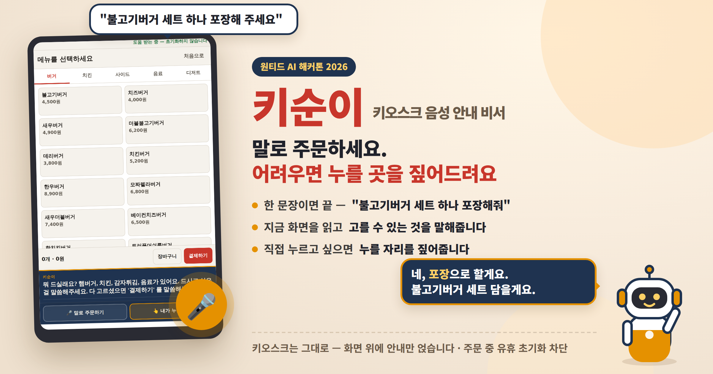
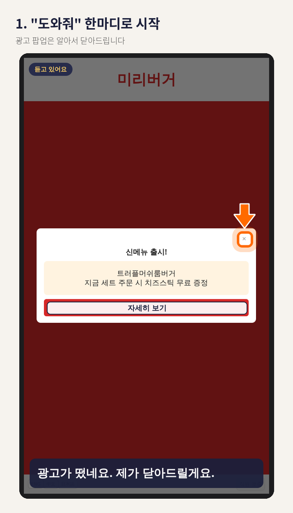
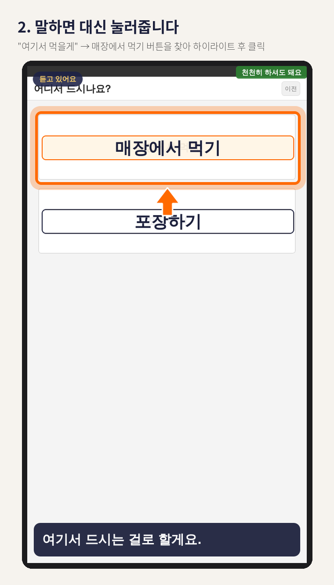
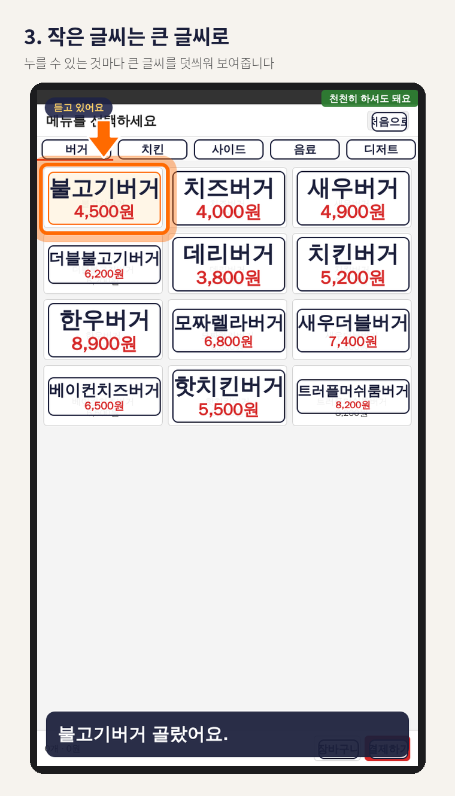
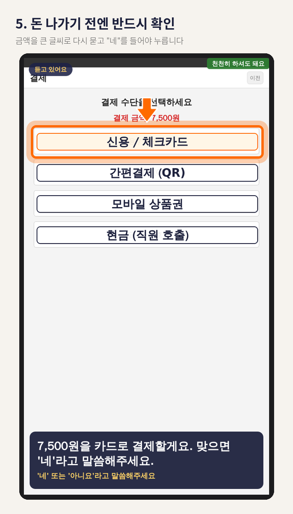
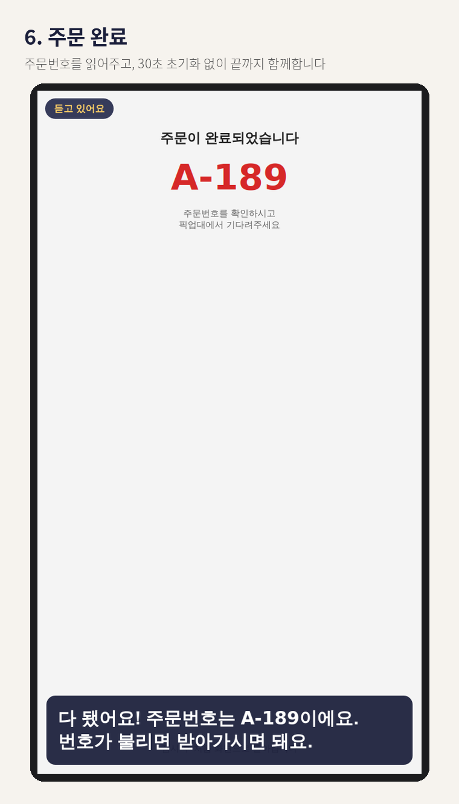

# 키순이 — 키오스크 안내 도우미

**▶ 체험하기:** https://buruk77778.github.io/talk-to-kiosk/
설치 없이 브라우저에서 바로 열립니다. 말은 해도 되고 안 해도 됩니다.

> 어르신이 키오스크를 못 쓰는 진짜 이유는 "말을 못 해서"가 아니라 **뭘 눌러야 할지 몰라서**입니다.
> 키오스크는 그대로 두고, 화면 위에 안내만 얹습니다.

## 이렇게 도와드려요

| | | |
|:-:|:-:|:-:|
|  |  |  |
|  |  | |

## AI 판단

- **Google Gemini Flash** — 지금 화면의 버튼 + 손님의 말 → 누를 순서와 안내 멘트
- **규칙 검증** — 화면에 없는 버튼은 누르지 않고, 돈이 걸린 동작은 "네"를 들어야 누름
- **규칙만으로도 동작** — AI 키가 없어도 끝까지 주문됩니다

미리버거는 시연용 가상 매장입니다 · 원티드 AI 해커톤 2026
